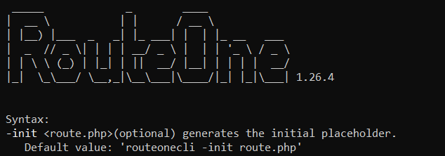

# RouteOne
It reads the URL route and parses the values of path, so it could be interpreted manually or automatically in the fastest way possible (for example, to implement an MVC system).  

[](https://packagist.org/packages/eftec/routeone)
[](https://packagist.org/packages/eftec/routeone)
[]()
[]()
[]()
[]()
[]()
[]()

Unlikely other libraries, this library does not have dependencies, and it is contained in a single class, so it is compatible with any PHP project, for example WordPress, Laravel, Drupal, a custom PHP project, etc.

This library is based in **CoC Convention over Configuration**. It reduces the boilerplate but it has fixed  functionalities.  This library does not allow to use custom "routes" but it covers practically all cases, so it increases the performance and usability while it sacrifices flexibility.

## Table of contents

<!-- TOC -->
* [RouteOne](#routeone)
  * [Table of contents](#table-of-contents)
  * [Example:](#example-)
  * [What it does?](#what-it-does)
    * [What is **$id**, **$idparent** and **$event**?](#what-is-id--idparent-and-event-)
    * [**id**](#id)
    * [**idparent**](#idparent)
    * [**event**](#event)
    * [**Module**](#module)
  * [Getting started](#getting-started)
    * [Using the cli (recommended)](#using-the-cli--recommended-)
      * [manual installation](#manual-installation)
      * [1) Create a .htaccess file in the folder root (Apache)](#1--create-a-htaccess-file-in-the-folder-root--apache-)
      * [Or configure nginx.conf (Nginx) Linux (not tested)](#or-configure-nginxconf--nginx--linux--not-tested-)
      * [Or configure nginx.conf (Nginx) Windows](#or-configure-nginxconf--nginx--windows)
  * [Using Paths](#using-paths)
    * [clearPath()](#clearpath--)
    * [addPath()](#addpath--)
    * [fetchPath()](#fetchpath--)
  * [Methods](#methods)
    * [__construct($base='', $forcedType=null, $isModule=false)](#--construct--base---forcedtypenull-ismodulefalse-)
    * [getQuery($key,$valueIfNotFound=null)](#getquery--keyvalueifnotfoundnull-)
    * [setQuery($key,$value)](#setquery--keyvalue-)
    * [fetch](#fetch)
    * [callObjectEx](#callobjectex)
    * [callFile($fileStructure='%s.php',$throwOnError=true)](#callfile--filestructuresphp--throwonerrortrue-)
    * [getHeader()](#getheader--)
    * [getBody()](#getbody--)
    * [](#)
    * [getCurrentUrl($withoutFilename = true)](#getcurrenturl--withoutfilename--true-)
    * [getCurrentServer()](#getcurrentserver--)
    * [setCurrentServer($serverName)](#setcurrentserver--servername-)
    * [getUrl($extraQuery = '',$includeQuery=false)](#geturl--extraquery----includequeryfalse-)
    * [url($module,$controller,$action,$id,$idparent)](#url--modulecontrolleractionididparent-)
    * [urlFront($module,$category,$subcategory,$subsubcategory,$id)](#urlfront--modulecategorysubcategorysubsubcategoryid-)
    * [alwaysWWW($https = false)](#alwayswww--https--false-)
    * [alwaysHTTPS()](#alwayshttps--)
    * [alwaysNakedDomain($https = false)](#alwaysnakeddomain--https--false-)
  * [fields](#fields)
  * [Whitelist](#whitelist)
    * [Whitelist input.](#whitelist-input)
  * [CLI](#cli)
  * [Changelog](#changelog)
<!-- TOC -->

## Example:

Let's say we have the next URL http://somedomain.dom/Customer/Update/2 This library converts this URL into variables that 
could be process or directly calling a method.

route.php
```php
$route=new RouteOne('http://www.somedomain.dom');
$route->addPath('api/{controller}/{action}/{id}'); 
$route->addPath('{controller}/{action}/{id}/{idparent}');
$route->fetchPath();
$this->callObjectEx('cocacola\controller\{controller}Controller');
```

controller\CustomerController.php class
```php
namespace cocacola\controller\;
class CustomerController {
   public function updateAction($id=null,$idparent=null,$event=null) {
      echo "We want to update the customer $id";
   }
}
 
```


## What it does?

Let's say we do the next operation:

A user calls the next website http://somedomain.com/Customer/Insert, he wants to show a form to insert a customer

```php
use \eftec\routeone\RouteOne;
$route=new RouteOne('.',null,null); // Create the RouteOneClass
$route->fetch(); // fetch all the input values (from the route, get, post and such).
$route->callObject('somenamespace\\controller\\%sController'); // where it will call the  class CustomerController* 
```

or

```php
use eftec\routeone\RouteOne;
$route=new RouteOne('.',null,null); // Create the RouteOneClass
$route->fetch(); // fetch all the input values (from the route, get, post and such).
$route->callObjectEx('somenamespace\\controller\\{controller}Controller'); // where it will call the  class CustomerController* 
```


This code calls to the method **InsertActionGet** (GET), **InsertActionPost** (POST) or **InsertAction** (GET/POST)
inside the class **Customer**

The method called is written as follows:

```php
class Customer {
    public function insertAction($id="",$idparent="",$event="") {
        // here we do our operation.
    }
}
```

### What is **$id**, **$idparent** and **$event**?

### **id**

Let's se we want to **Update** a **Customer** number **20**, then we could call the next page

> http://somedomain.com/Customer/Update/20 

where 20 is the "$id" of the customer to edit (it could be a number of a string)

### **idparent**

And what if we want to **Update** a **Customer** number **20** of the business **APPL**

> http://somedomain.com/Customer/Update/20/APPL

Where APPL is the **idparent** 

### **event**

Now, let's say we click on some button, or we do some action.  It could be captured by the field **_event**, and it 
is read by the argument **$event**. This variable could be sent via GET or POST.

> http://somedomain.com/Customer/Update/20/APPL?_event=click

### **Module**

> Note: Modules are obtained automatically if you use addPath() and fetchPath(), so you don't need to specify it.
Now, let's say our system is modular, and we have several customers (internal customers, external, etc.)

```php
$route=new RouteOne('.',null,true); // true indicates it is modular.
```

or

```php
$route=new RouteOne('.',null,['Internal']); // or we determine the module automatically. In this case, every url that starts with Internal
```

then

```php
$route->fetch(); 
$route->callObject('somenamespace\\%2s%\\controller\\%1sController');
```

> http://somedomain.com/Internal/Customer/Update/20/APPL?_event=click

Then, the first ramification is the name of the module (**Internal**) and it calls the class **somenamespace\Internal\controller\CustomerController**


## Getting started

### Using the cli (recommended)

* Install the library

> composer require eftec/routeone

* Execute the binary in the root folder

Linux:

```shell
vendor/bin/routeonecli -init  (if the binary does not work, then chage the permission to execution)
```
Windows:
```shell
.\vendor\bin\routeonecli.bat -init
```

It will create the file .htaccess and the file route.php and route.php will have a default configuration.

* Edit the file route.php and change the next lines:

```php
const BASEURL="http://localhost"; // Base url edit this value.
const BASEWEBNS="eftec\\controller"; // Base namespace (web) edit this value
const BASEAPINS="eftec\\api"; // Base namespace (api) edit this value
```
Later, you can add or edit the code in this file.

#### manual installation

#### 1) Create a .htaccess file in the folder root (Apache)

```
<IfModule mod_rewrite.c>
    <IfModule mod_negotiation.c>
        Options -MultiViews -Indexes
    </IfModule>

    RewriteEngine On
    DirectoryIndex route.php

    # Handle Authorization Header
    RewriteCond %{HTTP:Authorization} .
    RewriteRule .* - [E=HTTP_AUTHORIZATION:%{HTTP:Authorization}]

    # Redirect Trailing Slashes If Not A Folder...
    RewriteCond %{REQUEST_FILENAME} !-d
    RewriteCond %{REQUEST_URI} (.+)/$
    RewriteRule ^ %1 [L,R=301]

    # Send Requests To Front Controller...
    RewriteCond %{REQUEST_FILENAME} !-d
    RewriteCond %{REQUEST_FILENAME} !-f
    RewriteRule ^ route.php?req=$1 [L,QSA]
</IfModule>
```

> If your web host doesn't allow the FollowSymlinks option, try replacing it with Options +SymLinksIfOwnerMatch.   


> The important line is:    
> RewriteRule ^(.*)$ route.php?req=$1 [L,QSA]   # The router to call.

#### Or configure nginx.conf (Nginx) Linux (not tested)

```
server {
    listen 80;
    server_name localhost;
    root /example.com/public;

    add_header X-Frame-Options "SAMEORIGIN";
    add_header X-XSS-Protection "1; mode=block";
    add_header X-Content-Type-Options "nosniff";

    index index.html index.htm index.php;

    charset utf-8;

    location / {
        try_files $uri $uri/ /router.php?req=$document_uri&$query_string;
    }

    location = /favicon.ico { access_log off; log_not_found off; }
    location = /robots.txt  { access_log off; log_not_found off; }

    error_page 404 /index.php;

    location ~ \.php$ {
        fastcgi_pass unix:/var/run/php/php7.2-fpm.sock;
        fastcgi_index index.php;
        fastcgi_param SCRIPT_FILENAME $realpath_root$fastcgi_script_name;
        include fastcgi_params;
    }

    location ~ /\.(?!well-known).* {
        deny all;
    }
}

```

> The important line is:  
> try_files $uri $uri/ /router.php?req=$document_uri&$query_string;

#### Or configure nginx.conf (Nginx) Windows

```
server {
    listen 80;
    server_name localhost;
    root c:/www;

    add_header X-Frame-Options "SAMEORIGIN";
    add_header X-XSS-Protection "1; mode=block";
    add_header X-Content-Type-Options "nosniff";

    index index.html index.htm index.php;

    charset utf-8;

    location / {
        try_files $uri $uri/ /router.php?req=$document_uri&$query_string;
    }

    location = /favicon.ico { access_log off; log_not_found off; }
    location = /robots.txt  { access_log off; log_not_found off; }

    error_page 404 /index.php;

    location ~ \.php$ {
        fastcgi_pass   127.0.0.1:9000;
        fastcgi_index  index.php;
        fastcgi_param  SCRIPT_FILENAME  $document_root$fastcgi_script_name;
        include fastcgi_params;
    }

    location ~ /\.(?!well-known).* {
        deny all;
    }
}

```
> The important line is:  
> try_files $uri $uri/ /router.php?req=$document_uri&$query_string;


where **router.php** is the file that it will work as router.  ?req=$1 is important because the system will read the route from "req"

```php 
// router.php
$route=new RouteOne(); // Create the RouteOneClass
$route->fetch(); // fetch all the input values (from the route, get, post and such).
$route->callObject('somenamespace\\controller\\%sController'); // where it will call the  class \somenamespace\controller\CustomerController  
```

> Note:
>
> If you want to use an argument different as "req", then you can change it using the next code:
>
> $route->argumentName='newargument';


## Using Paths

Since 1.21, it is possible to use a custom path instead of a pre-defined path. It is the recommended way.
The other method is still present.

### clearPath()

Syntax:

>clearPath()

It clears all the paths defined

### addPath()

Syntax:

> addPath($path, $name = null)

It adds a new path.

The path could start with a static location but the rest of the path must be defined by variables (enclosed by {})
and separated by "/".
You can also set a default value for a path by writing ":" after the name of the variable: {name:defaultvalue}
The **name** could be obtained using $this->currentPath. If you add a name with the same name, then it is replaced.
If you don't set a name, then it uses an autonumeric.
The **name** is also returned when you call $this->fetchPath()


Example:

```php
$this->addPath('{controller}/{id}/{idparent}');
$this->addPath('myapi/otherfolder/{controller}/{id}/{idparent}');
$this->addPath('{controller:defcontroller}/{action:defaction}/{id:1}/{idparent:2}');

// url: /dummy/10/20 =>(controller: dummy, id=10, idparent=20)
// url: /myapi/otherfolder/dummy/10/20  =>(controller: dummy, id=10, idparent=20)
```

> You can define different paths, however it only uses the first part of the path that matches some URL.
> 'path/somepath/{id}' will work
> 'path/{id}/other' will not work

### fetchPath()

Syntax:

> fetchPath()

It fetches the path previously defined by addPath, and it returns the name(or number) of the path. If not found, then it returns false

Example:

```php
$route=new RouteOne('http://www.example.dom');
$route->addPath('{controller}/{id}/{idparent}','optionalname');
// if the url is : http://www.example.dom/customer/1/200 then it will return
echo $route->fetchPath(); // optionalname
echo $route->controller; // customer
echo $route->id; // 1
echo $route->idparent; // 200

```


## Methods

### __construct($base='', $forcedType=null, $isModule=false)

* string $base base url
* string $forcedType=['api','ws','controller','front']\[$i]<br>
    <b>api</b> then it expects a path as api/controller/action/id/idparent<br>
    <b>ws</b> then it expects a path as ws/controller/action/id/idparent<br>
    <b>controller</b> then it expects a path as controller/action/id/idparent<br>
    <b>front</b> then it expects a path as /category/subcategory/subsubcategory/id<br>
* bool   $isModule if true then the route start reading a module name<br>
    <b>false</b> controller/action/id/idparent<br>
    <b>true</b> module/controller/action/id/idparent<br>       
    <b>array</b> if the value is an array then the value is determined if the first part of the path is in the array.<br>
     Example ['modulefolder1','modulefolder2']<br>

### getQuery($key,$valueIfNotFound=null)

It gets a query value (URL).

>Note: This query does not include the values "req","_event" and "_extra"

Example:

```php 
// http://localhost/..../?id=hi
$id=$router->getQuery("id"); // hi
$nf=$router->getQuery("something","not found"); // not found
```

### setQuery($key,$value)

It sets a query value

Example:

```php 
$route->setQuery("id","hi");
$id=$router->getQuery("id"); // hi
```


### fetch

Sintax:
> fetchPath()

Fetch the values from the route, and the values are processed.

### callObjectEx

Sintax
> callObjectEx($classStructure, $throwOnError, $method, $methodGet, $methodPost,$arguments,$injectArguments)

It creates a new instance of an object (for example, a Controller object) and calls the method.<br>
Note: It is an advanced version of this::callObject()<br>
This method uses {} to replace values based in the next variables:<br>

| Tag              | Description                                        |
|------------------|----------------------------------------------------|
| {controller}     | The name of the controller                         |
| {action}         | The current action                                 |
| {event}          | The current event                                  |
| {type}           | The current type of path (ws,controller,front,api) |
| {module}         | The current module (if module is active)           |
| {id}             | The current id                                     |
| {idparent}       | The current idparent                               |
| {category}       | The current category                               |
| {subcategory}    | The current subcategory                            |
| {subsubcategory} | The current subsubcategory                         |

<b>Example:</b> 

```php
// controller example http://somedomain/Customer/Insert/23
$this->callObjectEx('cocacola\controller\{controller}Controller');
// it calls the method cocacola\controller\Customer::InsertAction(23,'','');

// front example: http://somedomain/product/coffee/nescafe/1
$this->callObjectEx('cocacola\controller\{category}Controller' // the class to call
        ,false // if error then it throw an error
        ,'{subcategory}' // the method to call (get, post or any other method)
        ,null // the method to call (method get)
        ,null // the method to call (method post)
        ,['subsubcategory','id'] // the arguments to call the method
        ,['arg1','arg2']); // arguments that will be passed to the constructor of the instance 
// it calls the method cocacola\controller\product::coffee('nescafe','1');
```

Call a method inside an object using the current route.

**Example:**

Router:

```php
$databaseService=new SomeDatabaseService();
$route=new RouteOne();

$route->callObjectEx('cocacola\controller\{controller}Controller' // the class to call
        ,false // if error then it throw an error
        ,'{action}Action' // the method to call (get, post or any other method)
        ,'{action}Action{verb}' // the method to call (method get)
        ,'{action}Action{verb}' // the method to call (method post)
        ,['id', 'idparent', 'event'] // the arguments to call the method
        ,[$databaseService,$route]); // (optional)arguments that will be passed to the constructor of the instance 

```

Controller:    

```php
namespace cocacola\controller;
class CustomerController {
	protected $databaseService;
    protected $route;
    public function __construct($databaseService,$route) {
        // optional: injecting services
		$this->databaseService=$databaseService;
		$this->route=$route;        
    }
    // any action GET or POST
    public function GreenAction($id="",$idparent="",$event="") {
    }
    // GET only action (optional)
    public function BlueActionGET($id="",$idparent="",$event="") {
        // **my code goes here.**
    }    
    // POST only action (optional)
    public function YellowActionPOST($id="",$idparent="",$event="") {
        // **my code goes here.**
    }    
    // GET only action (optional)
    public function RedActionGET($id="",$idparent="",$event="") {
        // **my code goes here.**
    }      
    // any action GET or POST
    public function RedAction($id="",$idparent="",$event="") {
        // **my code goes here.**
    }      
    
}
```
Results:

| url                                                      | method called                                     |
|----------------------------------------------------------|---------------------------------------------------|
| http://localhost/Customer/Green (GET)                    | GreenAction                                       |
| http://localhost/Customer/Green/20/30?_event=click (GET) | GreenAction($id=20, $idparent=30, $event='click') |
| http://localhost/Customer/Green (POST)                   | GreenAction                                       |
| http://localhost/Customer/Blue (GET)                     | BlueActionGET                                     |
| http://localhost/Customer/Blue (POST)                    | ERROR                                             |
| http://localhost/Customer/Yellow (GET)                   | ERROR                                             |
| http://localhost/Customer/Yellow (POST)                  | YellowActionPOST                                  |
| http://localhost/Customer/Red (GET)                      | RedActionGET (It has priority over RedAction)     |
| http://localhost/Customer/Red (POST)                     | RedAction                                         |
| http://localhost/Customer/Orange                         | ERROR                                             |


### callFile($fileStructure='%s.php',$throwOnError=true)

It calls (include) a php file using the current name of the controller

* **$fileStructure** The current name of the controller. "%s" is the name of the current controller. Example :/Customer/Insert -> calls the file Customer.php
* **throwOnError** if true then it throws an error. If false then it only returns the error message.

### getHeader()

Syntax:

> getHeader($key, $valueIfNotFound = null)

It gets the current header (if any). If the value is not found, then it returns $valueIfNotFound. Note, the $key is always converted to uppercase.

Example:

```php
$token=$this->getHeader('token','TOKEN NOT FOUND');
```

### getBody()

Syntax:

>  getBody($jsonDeserialize = false, $asAssociative = true)

It gets the body of a request.

Example:

```php
$body=$this->getBody(); // '{"id"=>1,"name"=>john}' (as string)
$body=$this->getBody(true); // stdClass {id=>1,name=>john}
$body=$this->getBody(true,true); // ["id"=>1,"name"=>john]
```

### 


### getCurrentUrl($withoutFilename = true)

Returns the current base url without traling space, paremters or queries

> <b>Note</b>: this function relies on $_SERVER['SERVER_NAME'], and  it could be modified by the end-user

### getCurrentServer()

It returns the current server without trailing slash.

```php 
$route->getCurrentServer(); // http://somedomain
```

### setCurrentServer($serverName)

It sets the current server name.  It is used by getCurrentUrl() and getCurrentServer().    
**Note:** If $this->setCurrentServer() is not set, then it uses $_SERVER['SERVER_NAME'], and it could be modified
 by the user.

```php 
$route->setCurrentServer('localhost'); 
$route->setCurrentServer('127.0.0.1'); 
$route->setCurrentServer('domain.dom'); 
```

### getUrl($extraQuery = '',$includeQuery=false)

It gets the (full) url based in the information in the class.

```php 
$route->getUrl(); // http://somedomain/controller/action/id
$route->getUrl('id=20'); // http://somedomain/controller/action/id?id=20
$route->getUrl('id=20',true); // http://somedomain/controller/action/id?id=20&field=20&field2=40
```

### url($module,$controller,$action,$id,$idparent)

It builds an url based in custom values

```php 
$route->url(null,"Customer","Update",20); // Customer/Update/20
```

### urlFront($module,$category,$subcategory,$subsubcategory,$id)

It builds an url (front) based in custom values

```php 
$route->url(null,"Daily","Milk",20); // Daily/Milk/20
```

### alwaysWWW($https = false) 

If the subdomain is empty or different to www, then it redirect to www.domain.com.<br>
<b>Note: It doesn't work with localhost, domain without TLD (netbios) or ip domains. It is on purpose.</b><br>
<b>Note: If this code needs to redirect, then it stops the execution of the code. Usually it must be called at the 
top of the code</b>

```php 
$route->alwaysWWW();  // if the domain is somedomain.dom/url, then it redirects to www.somedomain.dom/url
$route->alwaysWWW(true);  // if the domain is http: somedomain.dom/url, then it redirects to https: www.somedomain.dom/url

```

### alwaysHTTPS() 

If the page is loaded as http, then it redirects to https.    
<b>Note: It doesn't work with localhost, domain without TLD (netbios) or ip domains. It is on purpose.</b><br>
<b>Note: If this code needs to redirect, then it stops the execution of the code. Usually it must be called at 
the top of the code</b>

```php 
$route->alwaysHTTPS(); // http://somedomain.com ---> https://somedomain.com
$route->alwaysHTTPS(); // http://localhost ---> // http://localhost
$route->alwaysHTTPS(); // http://127.0.0.1 ---> // http://127.0.0.1
$route->alwaysHTTPS(); // http://mypc ---> // http://mypc
```

### alwaysNakedDomain($https = false) 

If the subdomain is www (example www.domain.dom) then it redirect to a naked domain domain.dom<br>   
<b>Note: It doesn't work with localhost, domain without TLD (netbios) or ip domains. It is on purpose.</b><br>  
<b>Note: If this code needs to redirect, then it stops the execution of the code. Usually,
it must be called at the top of the code</b>   

```php 
$route->alwaysNakedDomain();  // if the domain is www.somedomain.dom/url, then it redirects to somedomain.dom/url
$route->alwaysNakedDomain(true);  // if the domain is http: www.somedomain.dom/url, then it redirects to https: somedomain.dom/url

```

## fields

| Field           | path             | Description                                                              | Example                                                                 |
|-----------------|------------------|--------------------------------------------------------------------------|-------------------------------------------------------------------------|
| $argumentName   |                  | The name of the argument used by Apache .Htaccess and nginx              | $this-argumentName='req';                                               |
| $base           |                  | It is the base url.                                                      | $this->base=0;                                                          |
| $type           |                  | It is the type of url (api,ws,controller or front)                       | echo $this->type; // api                                                |
| $module         | {module}         | It's the current module                                                  | echo $this->module;                                                     |
| $controller     | {controller}     | It's the controller.                                                     | echo $this->controller;                                                 |
| $action         | {action}         | It's the action.                                                         | echo $this->action;                                                     |
| $id             | {id}             | It's the identifier                                                      | echo $this->id;                                                         |
| $event          | {event}          | It's the event (such as "click on button).                               | echo$this->event;                                                       |
| $idparent       | {idparent}       | It is the current parent id (if any)                                     | echo $this->idparent;                                                   |
| $extra          | {extra}          | It's the event (such as "click on button)                                | echo $this->extra;                                                      |
| $category       | {category}       | The current category. It is useful for the type 'front'                  | echo $this->category;                                                   |
| $subcategory    | {subcategory}    | The current sub-category. It is useful for the type 'front'              | echo $this->subcategory;                                                |
| $subsubcategory | {subsubcategory} | The current sub-sub-category. It is useful for the type  'front'         | echo $this->subsubcategory;                                             |
| $identify       |                  | It is an associative array that helps to identify the api and  ws route. | $this->identify=['api'=>'apiurl','ws'=>'webservices','controller'=>'']; |
| $isPostBack     |                  | its true if the page is POST, otherwise false.                           | if ($this->isPostBack) { ... };                                         |
| $verb           | {verb}           | The current verb, it could be GET,POST,PUT and DELETE.                   | if ($this->verb) { ... };                                               |

Example:
```php
$this->addPath('portal/web/{controller}/{action:list}');
$this->fetchPath();
var_dump($this-action); // it shows the current action or the default value "list" if none.
```

## Whitelist

| Field          | Description                                                                                                                                                                                                                                                                        | Example                                                                                                                                               |
|----------------|------------------------------------------------------------------------------------------------------------------------------------------------------------------------------------------------------------------------------------------------------------------------------------|-------------------------------------------------------------------------------------------------------------------------------------------------------|
| $allowedVerbs  | A list with allowed verbs                                                                                                                                                                                                                                                          | $this->allowedVerbs=['GET', 'POST', 'PUT', 'DELETE'];                                                                                                 |
| $allowedFields | A list with allowed fields used by **callObjectEx()**                                                                                                                                                                                                                              | $this->allowedFields=['controller', 'action', 'verb', 'event', 'type', 'module', 'id'<br />, 'idparent','category', 'subcategory', 'subsubcategory']; |
| setWhitelist() | It sets an associative array with the whitelist to **controller**, **action**, **category**, **subcategory**, **subsubcategory** and **module**. <br />If not set (null default value), then it allows any entry.<br />Currently it only work with **controller** and **category** | $this->setWhitelist('controller','Purchase','Invoice','Customer');<br />$this->setWhitelist('controller',null) // allows any controller;              |

### Whitelist input.
Whitelisting a method allows two operations:

* To whitelist an input, for example, only allowing "controllers" that they are inside a list.
* Also, it allows to define the case of an element.

For example:

```php
// Example, value not in the whitelist: someweb.dom/customer/list
$this->setWhiteList('controller',['Product','Client']);
$this->fetch();
var_dump($this->controller); // null or the default value
var_dump($this->notAllowed); // true (whitelist error)


// Example, value in the whitelist but with the wrong case: someweb.dom/customer/list
$this->setWhiteList('controller',['Customer']);
$this->fetch();
var_dump($this->controller); // it shows "Customer" instead of "customer"
var_dump($this->notAllowed); // false (not error with the validation of the whitelist)    
    
// reset whitelist for controllers
$this->setWhiteList('controller',null);        
```
## CLI
Routeone contains a basic CLI to create and initialize the configuration.
The binary **pdoonecli** is located in the vendor/bin folder




## Changelog
* 2023-02-15 1.27
  * Cleanup of the code and documentation. Deprecating old methods 
* 2023-02-14 1.26.4
  * some bug fixed
* 2023-01-27 1.26.2
  * edited composer json (bin) 
* 2023-01-27 1.26
  * callObject() marked as deprecated, however you still could use it.
  * arguments of function now uses type hinting/validation
  * addPath() now throws an exception if the path is empty or null.
  * new method redirect()
  * new CLI. 
* 2023-01-26 1.25
  * some cleanups 
* 2022-03-11 1.24
  * **[fix]** fix many problems when the url is null.
* 2022-02-01 1.23
  * [new] getRequest(), getPost(),getGet() 
* 2022-01-27 1.22
  * [new] callObjectEx allows adding arguments to the constructor.
  * [new] clearPath()
  * [new] addPath()
  * [new] fetchPath()
  * [new] getHeader()
  * [new] getBody()
* 2021-04-24 1.20
   * **constructor** Now it is possible to indicates the possible modules in the constructor.
   * Many cleanups of the code.
   *  New field called **$moduleList** including its setter and getters (by default this value is null)
   *  If **$moduleList** is not null then it is used to determine if the URL is a module or not
   *  New field called **$moduleStrategy** assigned in the constructor and in the setter and getters (by default this value is 'none')
* 2021-02-26 1.19
   * **setWhiteList()** now works with **controller** and **category**
   * **setWhiteList()** also works to define the correct proper case of the elements.
   * The method **callObjectEx()** allows to define the case. 
* 2021-02-26 1.18
   * new fields **$verb** (it gets the current verb, example GET, POST, etc.)
   * new whitelist elements:
     * $allowedVerbs The list of allowed verbs.
     * $allowedFields The list of allowed fields used by **callObjectEx()**
     * $allowedControllers The list of allowed controllers. If this list is set and the controller is not in the whitelist
       , then the controller is set as null
   * The method **callObjectEx()** allows to use the verb. The verb is always ucfirst.
     * Example $this->callObjectEx('cocacola\controller\{controller}Controller','{action}Action{verb}');
* 2021-02-16 1.17
   * removed all @ and replaced by **isset()**. Since this library is compatible with PHP 5.6, then it doesn't use "??" 
     operators.
   * **setDefaultValues()** trigger an error if it is called after fetch()
* 2021-02.11 1.16.1
    * fixed a problem with "api" and "ws" that it doesn't read the controller in the right position.  
* 2021-02-11 1.16
    * Removed Travis.
    * Lowered the requirement. Now, this library works in PHP 5.6 and higher (instead of PHP 7.0 and higher)
    * Constructor has a new argument, it could fetch() the values
    * alwaysHTTPS() has a new argument that it could return the full URL (if it requires redirect) or null
    * alwaysWWW() has a new argument that it could return the full URL (if it requires redirect) or null
    * alwaysNakedDomain() has a new argument that it could return the full URL (if it requires redirect) or null
* 2020-06-14 1.15
    * Added default values in setDefaultValues().     
    * Method fetch() now it unset the value.    
    * Fixed Method url().  
* 2020-06-07 1.14.2
    * Bug fixed: Delete an echo (used for debug)
* 2020-06-07 1.14.1
    * Solved a small bug. it keeps the compatibility.   
* 2020-06-07 1.14
    * added defcategory,defsubcategory and defsubsubcategory
    * new method setIdentifyType()
* 2020-04-23 1.13
    * Lots of cleanups. 
* 2020-04-04 1.12 
    * added support for nginx.
    * updated the documentation for .htaccess
    * new method setCurrentServer()
* 2020-03-27 1.11
    * added alwaysNakedDomain()
* 2020-03-27 1.10.1
    * a small fix for alwaysHTTPS() 
* 2020-03-27 1.10
    * added method alwaysHTTPS() and alwaysWWW()
* 2020-02-15 1.9
    * added new arguments to callObject()
    * new method callObjectEx()
* 2020-02-03 1.8
    * new method getNonRouteUrl()
    * new method setExtra()
    * new method isPostBack()
    * new method setIsPostBack()
    * Some fixes for getUrl() 
